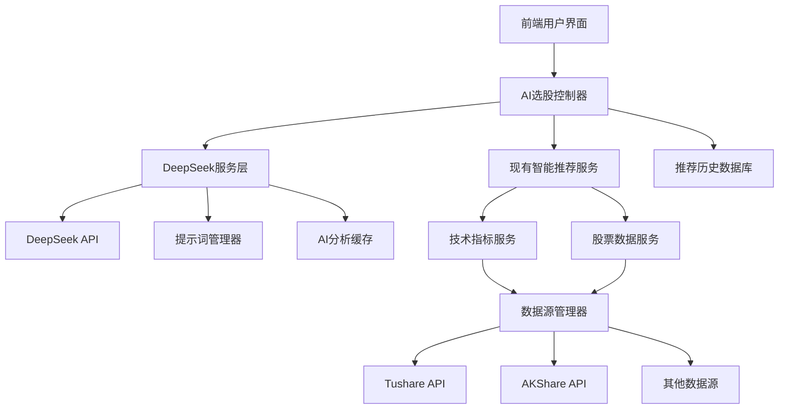
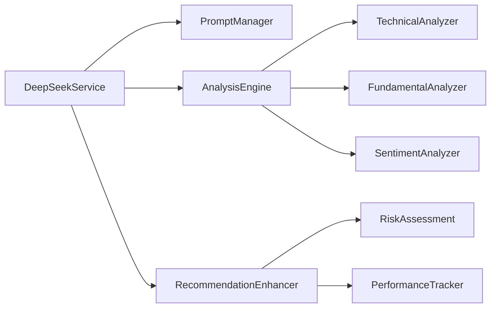
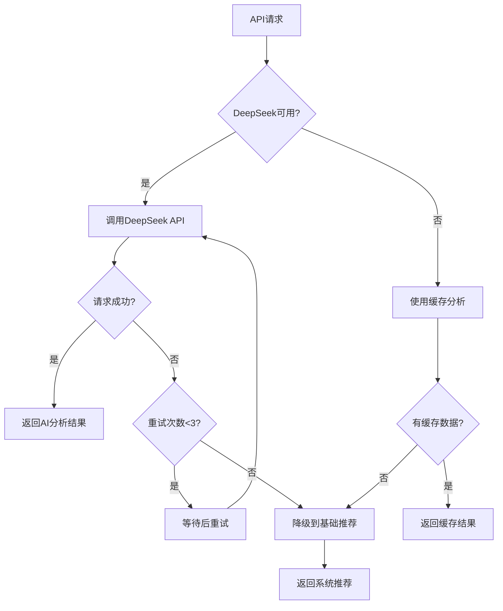

# 设计文档

## 概述

本设计文档描述了如何通过集成 DeepSeek 大语言模型来增强现有的 AI 选股功能。系统将在现有的智能推荐服务基础上，添加 DeepSeek AI 分析能力，提供更智能、更准确的股票分析和推荐。

## 架构

### 整体架构



### 服务层架构



## 组件和接口

### 1. DeepSeek 服务 (DeepSeekService)

**职责：** 管理与 DeepSeek API 的交互，处理 AI 分析请求

**接口：**

```javascript
class DeepSeekService {
  // 获取AI股票推荐
  async getAIRecommendations(params)

  // 分析单个股票
  async analyzeStock(symbol, analysisType)

  // 生成投资洞察
  async generateInsights(stockData, userPreferences)

  // 批量分析股票
  async batchAnalyzeStocks(symbols, criteria)
}
```

### 2. 提示词管理器 (PromptManager)

**职责：** 管理和优化发送给 DeepSeek 的提示词

**接口：**

```javascript
class PromptManager {
  // 构建股票分析提示词
  buildAnalysisPrompt(stockData, analysisType)

  // 构建推荐提示词
  buildRecommendationPrompt(stockPool, userCriteria)

  // 构建风险评估提示词
  buildRiskAssessmentPrompt(stockData, riskLevel)

  // 优化提示词
  optimizePrompt(basePrompt, context)
}
```

### 3. AI 分析引擎 (AnalysisEngine)

**职责：** 整合技术分析、基本面分析和情绪分析

**接口：**

```javascript
class AnalysisEngine {
  // 综合分析
  async comprehensiveAnalysis(stockData)

  // 技术分析
  async technicalAnalysis(priceData, indicators)

  // 基本面分析
  async fundamentalAnalysis(financialData)

  // 市场情绪分析
  async sentimentAnalysis(newsData, socialData)
}
```

### 4. 推荐增强器 (RecommendationEnhancer)

**职责：** 使用 AI 分析结果增强现有推荐

**接口：**

```javascript
class RecommendationEnhancer {
  // 增强推荐结果
  async enhanceRecommendations(baseRecommendations, aiAnalysis)

  // 生成推荐理由
  async generateReasons(stockAnalysis)

  // 计算置信度分数
  calculateConfidenceScore(analysisResults)

  // 个性化推荐
  async personalizeRecommendations(recommendations, userProfile)
}
```

## 数据模型

### AI 推荐记录 (ai_recommendation_history)

```sql
CREATE TABLE ai_recommendation_history (
  id INT PRIMARY KEY AUTO_INCREMENT,
  user_id INT,
  request_id VARCHAR(64) UNIQUE,
  stock_symbol VARCHAR(20),
  recommendation_type ENUM('buy', 'hold', 'sell'),
  confidence_score DECIMAL(5,2),
  ai_analysis TEXT,
  reasoning TEXT,
  risk_level ENUM('low', 'medium', 'high'),
  expected_return DECIMAL(5,4),
  target_price DECIMAL(10,2),
  stop_loss_price DECIMAL(10,2),
  created_at TIMESTAMP DEFAULT CURRENT_TIMESTAMP,
  updated_at TIMESTAMP DEFAULT CURRENT_TIMESTAMP ON UPDATE CURRENT_TIMESTAMP,
  INDEX idx_user_created (user_id, created_at),
  INDEX idx_symbol_created (stock_symbol, created_at)
);
```

### AI 分析缓存 (ai_analysis_cache)

```sql
CREATE TABLE ai_analysis_cache (
  id INT PRIMARY KEY AUTO_INCREMENT,
  stock_symbol VARCHAR(20),
  analysis_type VARCHAR(50),
  analysis_data JSON,
  confidence_score DECIMAL(5,2),
  expires_at TIMESTAMP,
  created_at TIMESTAMP DEFAULT CURRENT_TIMESTAMP,
  UNIQUE KEY uk_symbol_type (stock_symbol, analysis_type),
  INDEX idx_expires (expires_at)
);
```

### DeepSeek API 使用记录 (deepseek_api_usage)

```sql
CREATE TABLE deepseek_api_usage (
  id INT PRIMARY KEY AUTO_INCREMENT,
  request_id VARCHAR(64),
  user_id INT,
  api_endpoint VARCHAR(100),
  tokens_used INT,
  response_time_ms INT,
  cost_cents INT,
  success BOOLEAN,
  error_message TEXT,
  created_at TIMESTAMP DEFAULT CURRENT_TIMESTAMP,
  INDEX idx_user_created (user_id, created_at),
  INDEX idx_created (created_at)
);
```

### 用户 AI 偏好设置 (user_ai_preferences)

```sql
CREATE TABLE user_ai_preferences (
  id INT PRIMARY KEY AUTO_INCREMENT,
  user_id INT UNIQUE,
  risk_tolerance ENUM('conservative', 'moderate', 'aggressive'),
  investment_horizon ENUM('short', 'medium', 'long'),
  sector_preferences JSON,
  analysis_depth ENUM('basic', 'detailed', 'comprehensive'),
  notification_settings JSON,
  created_at TIMESTAMP DEFAULT CURRENT_TIMESTAMP,
  updated_at TIMESTAMP DEFAULT CURRENT_TIMESTAMP ON UPDATE CURRENT_TIMESTAMP
);
```

## 错误处理

### 错误类型和处理策略

1. **DeepSeek API 错误**

   - 连接超时：重试机制，最多 3 次
   - 配额超限：降级到缓存结果或基础推荐
   - 认证失败：记录错误，返回系统推荐

2. **数据质量错误**

   - 数据不足：使用可用数据进行简化分析
   - 数据异常：数据清洗和验证
   - 格式错误：数据转换和标准化

3. **系统错误**
   - 内存不足：分批处理
   - 数据库连接失败：使用缓存数据
   - 服务不可用：优雅降级

### 错误处理流程



## 测试策略

### 单元测试

1. **DeepSeek 服务测试**

   - API 调用测试
   - 错误处理测试
   - 重试机制测试
   - 缓存逻辑测试

2. **提示词管理器测试**

   - 提示词生成测试
   - 参数验证测试
   - 模板渲染测试

3. **分析引擎测试**
   - 数据处理测试
   - 算法逻辑测试
   - 结果格式测试

### 集成测试

1. **端到端流程测试**

   - 用户请求 → AI 分析 → 推荐结果
   - 错误场景处理
   - 性能基准测试

2. **API 集成测试**
   - DeepSeek API 集成
   - 数据源集成
   - 缓存系统集成

### 性能测试

1. **负载测试**

   - 并发用户测试
   - API 调用频率测试
   - 系统资源使用测试

2. **压力测试**
   - 极限负载测试
   - 故障恢复测试
   - 数据一致性测试

## 安全考虑

### API 密钥管理

1. **密钥存储**

   - 环境变量存储
   - 加密存储
   - 定期轮换

2. **访问控制**
   - 用户权限验证
   - API 调用限制
   - 审计日志

### 数据安全

1. **敏感数据保护**

   - 用户数据加密
   - 传输加密
   - 访问日志记录

2. **隐私保护**
   - 数据最小化原则
   - 用户同意机制
   - 数据删除策略

## 监控和日志

### 监控指标

1. **业务指标**

   - AI 推荐准确率
   - 用户满意度
   - 推荐转化率

2. **技术指标**

   - API 响应时间
   - 错误率
   - 系统资源使用率

3. **成本指标**
   - DeepSeek API 使用成本
   - 服务器资源成本
   - 运维成本

### 日志策略

1. **结构化日志**

   - JSON 格式日志
   - 统一日志格式
   - 关键字段标准化

2. **日志级别**

   - ERROR: 系统错误和异常
   - WARN: 警告和降级处理
   - INFO: 关键业务操作
   - DEBUG: 详细调试信息

3. **日志存储和分析**
   - 日志轮转策略
   - 日志聚合分析
   - 实时告警机制

## 部署和运维

### 部署架构

1. **微服务部署**

   - DeepSeek 服务独立部署
   - 负载均衡配置
   - 服务发现机制

2. **容器化部署**
   - Docker 容器化
   - Kubernetes 编排
   - 自动扩缩容

### 运维策略

1. **监控告警**

   - 服务健康检查
   - 性能监控
   - 异常告警

2. **备份恢复**

   - 数据备份策略
   - 灾难恢复计划
   - 业务连续性保障

3. **版本管理**
   - 灰度发布
   - 回滚机制
   - 版本兼容性
