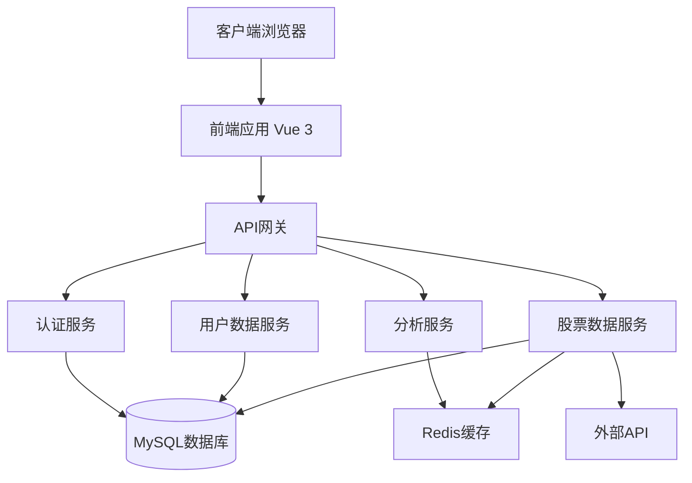
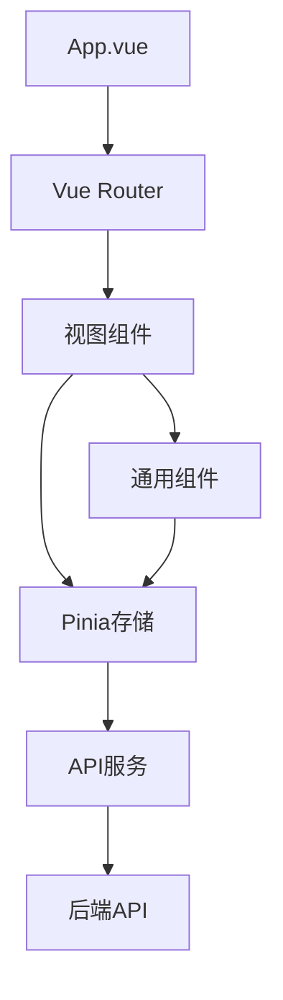
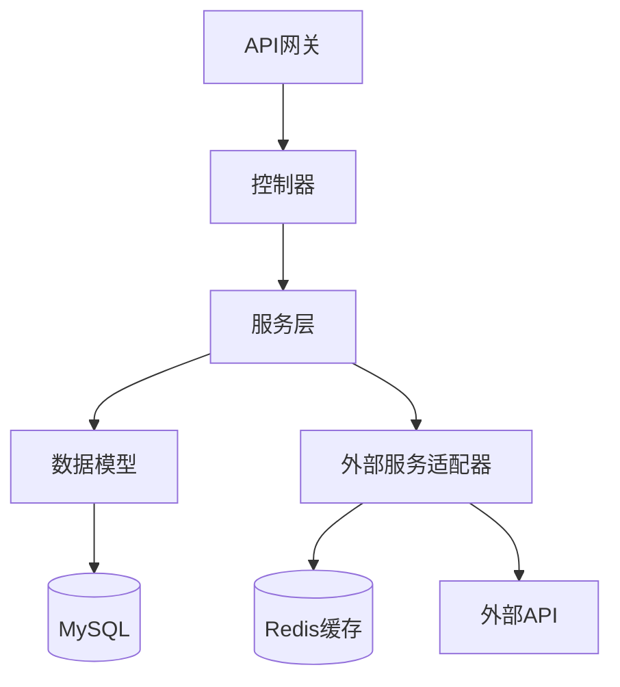
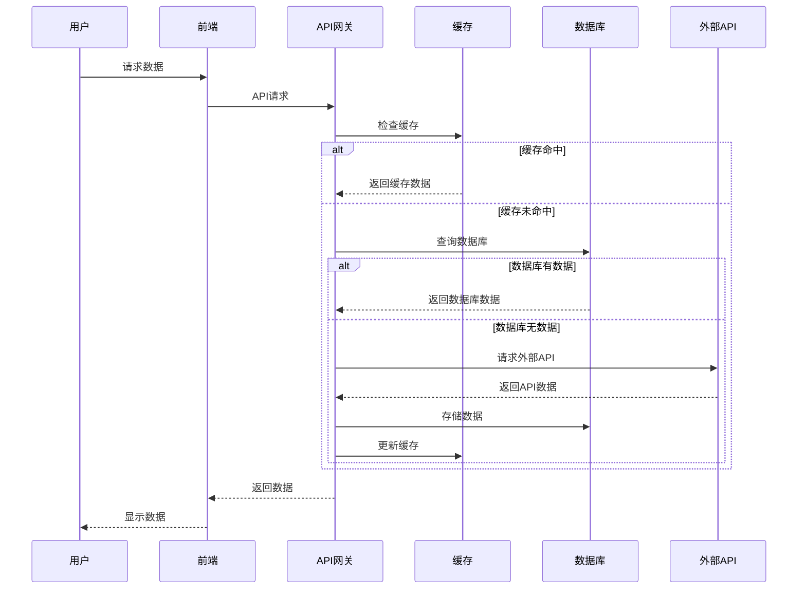

# 设计文档

## 概述

本设计文档详细说明了股票分析网站项目重构的技术方法。基于需求文档中确定的目标，我们将重新设计系统架构，专注于核心功能，提高性能，并增强用户体验。重构将保留有价值的功能，同时移除或简化不必要的复杂性。

## 架构

### 总体架构

我们将采用现代化的前后端分离架构，保持现有的技术栈（Vue 3 + TypeScript + Vite 前端，Node.js + Egg.js 后端），但进行以下优化：



### 前端架构

前端将采用基于组件的架构，使用 Pinia 进行状态管理，Vue Router 进行路由管理：



### 后端架构

后端将保持 Egg.js 框架，但进行以下优化：



### 数据流



## 组件和接口

### 核心组件

1. **认证组件**

   - 登录/注册
   - 会话管理
   - 权限控制

2. **股票搜索与浏览组件**

   - 快速搜索
   - 高级筛选
   - 结果展示

3. **股票详情组件**

   - 基本信息
   - 价格图表
   - 技术指标

4. **技术分析组件**

   - 指标计算
   - 图表展示
   - 参数配置

5. **关注列表组件**

   - 添加/删除股票
   - 批量操作
   - 性能概览

6. **投资组合组件**

   - 持仓管理
   - 性能分析
   - 交易记录

7. **用户设置组件**
   - 个人资料
   - 偏好设置
   - 订阅管理

### API 接口

#### 认证 API

```
POST /api/v1/auth/register - 用户注册
POST /api/v1/auth/login - 用户登录
POST /api/v1/auth/logout - 用户登出
GET /api/v1/auth/profile - 获取用户资料
PUT /api/v1/auth/profile - 更新用户资料
```

#### 股票 API

```
GET /api/v1/stocks/search - 搜索股票
GET /api/v1/stocks/:symbol - 获取股票详情
GET /api/v1/stocks/:symbol/history - 获取历史数据
GET /api/v1/stocks/:symbol/indicators - 获取技术指标
```

#### 关注列表 API

```
GET /api/v1/watchlist - 获取关注列表
POST /api/v1/watchlist - 添加股票到关注列表
DELETE /api/v1/watchlist/:id - 从关注列表删除股票
```

#### 投资组合 API

```
GET /api/v1/portfolio - 获取投资组合
POST /api/v1/portfolio - 添加持仓
PUT /api/v1/portfolio/:id - 更新持仓
DELETE /api/v1/portfolio/:id - 删除持仓
GET /api/v1/portfolio/performance - 获取投资组合表现
```

## 数据模型

### 用户模型

```typescript
interface User {
  id: string
  username: string
  email: string
  passwordHash: string
  createdAt: Date
  updatedAt: Date
  lastLoginAt: Date
  isActive: boolean
  role: 'user' | 'admin'
}

interface UserPreference {
  userId: string
  theme: 'light' | 'dark'
  defaultChartType: string
  defaultTimeframe: string
  notifications: boolean
}

interface Subscription {
  userId: string
  plan: 'free' | 'basic' | 'premium'
  startDate: Date
  endDate: Date
  isActive: boolean
  paymentStatus: string
}
```

### 股票模型

```typescript
interface Stock {
  symbol: string
  name: string
  exchange: string
  industry: string
  description: string
  lastUpdated: Date
  dataSource: string
}

interface StockPrice {
  symbol: string
  date: Date
  open: number
  high: number
  low: number
  close: number
  volume: number
  adjustedClose: number
  dataSource: string
}

interface TechnicalIndicator {
  symbol: string
  date: Date
  type: string // 'MA', 'MACD', 'RSI', etc.
  parameters: Record<string, any>
  values: Record<string, number>
}
```

### 关注列表模型

```typescript
interface WatchlistItem {
  id: string
  userId: string
  symbol: string
  addedAt: Date
  notes: string
  alertSettings: AlertSetting[]
}

interface AlertSetting {
  id: string
  watchlistItemId: string
  type: 'price' | 'volume' | 'percent'
  condition: 'above' | 'below' | 'equals'
  value: number
  isActive: boolean
  lastTriggered: Date | null
}
```

### 投资组合模型

```typescript
interface Portfolio {
  id: string
  userId: string
  name: string
  description: string
  createdAt: Date
  updatedAt: Date
}

interface Position {
  id: string
  portfolioId: string
  symbol: string
  quantity: number
  averagePrice: number
  openDate: Date
  notes: string
}

interface Transaction {
  id: string
  portfolioId: string
  symbol: string
  type: 'buy' | 'sell'
  quantity: number
  price: number
  date: Date
  fees: number
  notes: string
}
```

## 缓存策略

为了提高性能并减少对外部 API 的依赖，我们将实施多层缓存策略：

### 客户端缓存

- 使用浏览器本地存储（localStorage）缓存用户偏好、最近查看的股票和 UI 状态
- 实施合理的过期策略，确保数据不会过时
- 清晰地向用户指示数据的新鲜度

### 服务器缓存

- 使用 Redis 缓存频繁访问的数据，如股票列表、热门股票和市场指数
- 为不同类型的数据实施不同的缓存过期策略：
  - 股票基本信息：24 小时
  - 日线历史数据：24 小时
  - 实时价格数据：5 分钟
  - 技术指标：根据计算复杂性，5-60 分钟
- 实施缓存预热机制，确保热门数据始终可用

### 数据库缓存

- 将频繁访问但不经常变化的数据存储在数据库中
- 使用定时任务定期从外部 API 更新数据
- 实施增量更新策略，只获取新数据

## 错误处理与降级策略

为了确保系统在各种条件下都能可靠运行，我们将实施全面的错误处理和降级策略：

### 错误处理

- 实施统一的错误处理中间件，捕获并记录所有错误
- 为用户提供友好的错误消息，隐藏技术细节
- 对关键错误实施自动报警机制

### 降级策略

1. **数据源降级**

   - 当首选数据源不可用时，自动切换到备用数据源
   - 当所有外部 API 都不可用时，使用缓存数据
   - 当缓存也不可用时，使用最后已知的数据
   - 在极端情况下，提供静态数据或友好的错误页面

2. **功能降级**
   - 识别核心功能和非核心功能
   - 在系统负载高时，优先保证核心功能的可用性
   - 为非核心功能实施优雅的降级机制

## 性能优化

为了确保系统响应迅速，我们将实施以下性能优化：

### 前端优化

- 实施代码分割，按需加载组件
- 优化资源加载，使用适当的预加载和懒加载策略
- 优化渲染性能，减少不必要的重渲染
- 实施虚拟滚动，高效处理大列表
- 优化图表渲染，使用增量更新而非完全重绘

### 后端优化

- 优化数据库查询，添加适当的索引
- 实施数据库连接池，高效管理连接
- 优化 API 响应，只返回必要的数据
- 实施请求合并，减少 API 调用次数
- 使用流处理大型数据集

### API 优化

- 实施 GraphQL，允许客户端指定所需的确切数据
- 支持部分响应，只返回请求的字段
- 实施批处理 API，允许一次请求多个资源
- 优化 API 设计，减少往返次数

## 安全考虑

为了保护用户数据和系统完整性，我们将实施以下安全措施：

- 使用 HTTPS 加密所有通信
- 实施 JWT 认证，安全管理用户会话
- 实施适当的 CORS 策略，防止跨站请求伪造
- 实施输入验证，防止注入攻击
- 实施速率限制，防止暴力攻击和滥用
- 定期进行安全审计和漏洞扫描

## 测试策略

为了确保系统质量，我们将实施全面的测试策略：

### 单元测试

- 为所有关键功能编写单元测试
- 使用 Vitest 进行前端测试
- 使用 Egg-Mock 进行后端测试
- 目标测试覆盖率：80%

### 集成测试

- 测试组件之间的交互
- 测试前后端集成
- 测试第三方 API 集成

### 端到端测试

- 使用 Cypress 进行关键用户流程的端到端测试
- 测试真实用户场景
- 测试跨浏览器兼容性

### 性能测试

- 测试系统在不同负载下的性能
- 识别并解决性能瓶颈
- 确保系统满足性能要求

## 部署与 DevOps

为了简化开发和部署流程，我们将实施以下 DevOps 实践：

- 使用 Docker 容器化应用程序
- 实施 CI/CD 管道，自动化构建、测试和部署
- 使用环境变量管理配置
- 实施日志聚合和监控
- 实施自动扩展，根据负载调整资源

## 迁移策略

为了平稳过渡到新架构，我们将采用以下迁移策略：

1. **数据迁移**

   - 设计数据迁移脚本，将现有数据转换为新格式
   - 实施数据验证，确保迁移准确性
   - 保留历史数据的备份

2. **功能迁移**

   - 识别核心功能，优先迁移
   - 为每个功能创建详细的迁移计划
   - 实施功能开关，允许逐步启用新功能

3. **用户迁移**
   - 提供清晰的用户通信，解释变更
   - 提供新旧系统之间的过渡期
   - 收集用户反馈，快速解决问题

## 技术债务管理

为了防止未来积累技术债务，我们将实施以下策略：

- 定期代码审查，确保代码质量
- 维护全面的文档，便于知识传递
- 定期重构，解决新出现的技术债务
- 实施性能和代码质量监控
- 为开发团队提供持续培训
