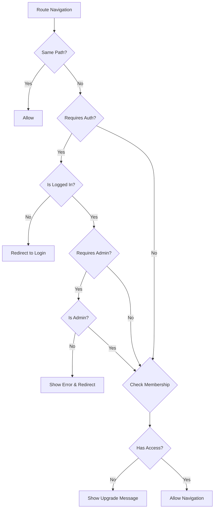

# Router Architecture

This document describes the optimized router structure with improved organization, lazy loading, and unified guard system.

## Router Structure

### Organized Route Groups

Routes are now organized by feature domains for better maintainability:

```
├── Public Routes (/)
├── Authentication (/auth)
├── Dashboard (/dashboard)
├── Stock Analysis (/stock)
├── Market Analysis (/market)
├── Portfolio (/portfolio)
├── Trading Strategies (/strategies)
├── Backtesting (/backtest)
├── Alerts (/alerts)
├── Doji Pattern (/doji-pattern)
├── Risk Management (/risk)
├── Tools (/tools)
├── User Management (/user)
├── Membership (/membership)
├── Settings (/settings)
├── Admin (/admin)
├── Development (/dev) - Dev only
└── Legacy Redirects
```

### Route Metadata

Each route includes comprehensive metadata:

```typescript
{
  path: '/stock/monitor',
  name: 'stock-monitor',
  component: () => import('../views/StockMonitorView.vue'),
  meta: {
    requiresAuth: true,
    requiredMembershipLevel: MembershipLevel.BASIC,
    title: '股票监控',
  },
}
```

**Metadata Properties:**

- `requiresAuth` - Requires user authentication
- `requiresAdmin` - Requires admin privileges
- `hideForAuth` - Hide from authenticated users (auth pages)
- `requiredMembershipLevel` - Required membership level
- `membershipLevel` - Legacy membership requirement
- `title` - Page title for SEO and breadcrumbs

## Guard System

### Unified Route Guards

All route protection logic is consolidated into a single, efficient guard system:

```typescript
// guards.ts
export async function routeGuard(to, from, next) {
  // 1. Authentication check
  // 2. Admin privilege check
  // 3. Membership level check
  // 4. Page-specific access control
  // 5. Allow navigation
}
```

### Guard Features

- **Duplicate navigation prevention** - Avoids processing same route twice
- **Permission message tracking** - Prevents spam notifications
- **Graceful error handling** - Fallback to safe routes on errors
- **Development route protection** - Hides dev routes in production
- **SEO optimization** - Sets page titles and meta tags

### Guard Flow



## Lazy Loading Strategy

### Component-Level Lazy Loading

All non-critical routes use dynamic imports:

```typescript
component: () => import('../views/StockAnalysisView.vue')
```

### Route-Level Code Splitting

Routes are automatically split into separate chunks:

- Core routes (dashboard, auth) - Loaded immediately
- Feature routes - Loaded on demand
- Admin routes - Loaded only for admins
- Dev routes - Excluded from production builds

### Preloading Strategy

Critical routes can be preloaded:

```typescript
import { preloadRoute } from '@/router/utils'

// Preload likely next routes
await preloadRoute(router, 'stock-analysis')
```

## Route Utilities

### Safe Navigation

```typescript
import { safeNavigate } from '@/router/utils'

// Navigate with error handling
await safeNavigate(router, '/stock/analysis', {
  fallback: '/dashboard',
  showError: true,
})
```

### Authentication-Aware Navigation

```typescript
import { navigateWithAuth } from '@/router/utils'

// Navigate only if authenticated
await navigateWithAuth(router, '/portfolio')
```

### Membership-Aware Navigation

```typescript
import { navigateWithMembership } from '@/router/utils'

// Navigate only if user has required membership
await navigateWithMembership(router, '/backtest', 'premium')
```

### Breadcrumb Generation

```typescript
import { generateBreadcrumb } from '@/router/utils'

const breadcrumb = generateBreadcrumb(route)
// [{ name: '首页', path: '/' }, { name: '股票分析', path: '/stock' }]
```

## Performance Optimizations

### 1. Route-Based Code Splitting

- Each route group is split into separate chunks
- Reduces initial bundle size
- Improves first page load time

### 2. Intelligent Preloading

- Preload likely next routes based on user behavior
- Background loading during idle time
- Cache preloaded components

### 3. Guard Optimization

- Early returns for common cases
- Cached permission checks
- Minimal API calls in guards

### 4. Development Route Exclusion

- Test routes excluded from production builds
- Reduces production bundle size
- Improves security

## Migration Guide

### From Old Route Structure

```typescript
// Old
{
  path: '/login',
  name: 'login',
  component: LoginView
}

// New
{
  path: '/auth/login',
  name: 'login',
  component: () => import('../views/auth/LoginView.vue')
}

// Legacy redirect provided
{ path: '/login', redirect: '/auth/login' }
```

### Guard Migration

```typescript
// Old - Multiple guard files
import { membershipGuard } from './membershipGuard'
import { pageGuard } from './pageGuard'

// New - Unified guard system
import { routeGuard } from './guards'
router.beforeEach(routeGuard)
```

### Navigation Updates

```typescript
// Old - Direct router usage
router.push('/some-route')

// New - Safe navigation with utilities
import { safeNavigate } from '@/router/utils'
await safeNavigate(router, '/some-route')
```

## Best Practices

### 1. Route Organization

- Group related routes under common parent
- Use nested routes for hierarchical features
- Keep route names descriptive and consistent

### 2. Metadata Usage

- Always include `title` for SEO
- Set appropriate auth requirements
- Use consistent membership level checks

### 3. Component Loading

- Use lazy loading for all non-critical routes
- Preload components for likely navigation paths
- Handle loading states gracefully

### 4. Guard Implementation

- Keep guards lightweight and fast
- Cache permission checks when possible
- Provide clear error messages to users

### 5. Navigation Patterns

- Use route utilities for complex navigation
- Handle errors gracefully with fallbacks
- Provide user feedback for navigation failures

## Development Guidelines

### Adding New Routes

1. Choose appropriate parent group
2. Add comprehensive metadata
3. Use lazy loading for components
4. Test with different user roles
5. Update documentation

### Modifying Guards

1. Test with all user types
2. Ensure no infinite redirects
3. Provide clear error messages
4. Update guard tests

### Route Testing

```typescript
// Test route access
describe('Route Access', () => {
  it('should allow premium users to access backtest', async () => {
    // Setup premium user
    // Navigate to backtest route
    // Assert successful navigation
  })
})
```

## Troubleshooting

### Common Issues

1. **Infinite Redirects**

   - Check guard logic for circular redirects
   - Ensure bypass routes are properly handled

2. **Permission Errors**

   - Verify user store state
   - Check membership level mapping

3. **Lazy Loading Failures**

   - Check component import paths
   - Verify component exports

4. **Guard Performance**
   - Profile guard execution time
   - Optimize expensive operations
   - Cache frequently accessed data
